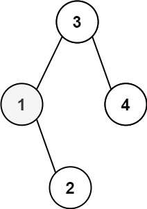

# 二叉搜索树的最小绝对差
给你一个二叉搜索树的根节点 root ，返回 树中任意两不同节点值之间的最小差值 。

差值是一个正数，其数值等于两值之差的绝对值。

示例 1：

    输入：root = [2,1,3]
    输出：true
# 二叉搜索树中第K小的元素
给定一个二叉搜索树的根节点 root ，和一个整数 k ，请你设计一个算法查找其中第 k 个最小元素（从 1 开始计数）。

示例 1：

    输入：root = [3,1,4,null,2], k = 1
    输出：1
# 验证二叉搜索树
给你一个二叉树的根节点 root ，判断其是否是一个有效的二叉搜索树。

有效二叉搜索树定义如下：

- 节点的左子树只包含 小于 当前节点的数。
- 节点的右子树只包含 大于 当前节点的数。
- 所有左子树和右子树自身必须也是二叉搜索树。

示例 1：

    输入：root = [4,2,6,1,3]
    输出：1