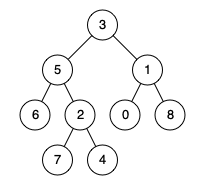

# 二叉树的最大深度
给定一个二叉树 root ，返回其最大深度。

二叉树的 最大深度 是指从根节点到最远叶子节点的最长路径上的节点数。

示例 1：

输入：root = [3,9,20,null,null,15,7]
输出：3
示例 2：

输入：root = [1,null,2]
输出：2

# 翻转二叉树
给你一棵二叉树的根节点 root ，翻转这棵二叉树，并返回其根节点。

示例 1：

输入：root = [4,2,7,1,3,6,9]
输出：[4,7,2,9,6,3,1]

示例 2：

输入：root = [2,1,3]
输出：[2,3,1]

# 对称二叉树
给你一个二叉树的根节点 root ， 检查它是否轴对称。

示例 1：

输入：root = [1,2,2,3,4,4,3]
输出：true

示例 2：

输入：root = [1,2,2,null,3,null,3]
输出：false

# 二叉树中的最大路径和
二叉树中的 路径 被定义为一条节点序列，序列中每对相邻节点之间都存在一条边。同一个节点在一条路径序列中 至多出现一次 。该路径 至少包含一个 节点，且不一定经过根节点。

路径和 是路径中各节点值的总和。

给你一个二叉树的根节点 root ，返回其 最大路径和 。

示例 1：

输入：root = [1,2,3]
输出：6
解释：最优路径是 2 -> 1 -> 3 ，路径和为 2 + 1 + 3 = 6

示例 2：

输入：root = [-10,9,20,null,null,15,7]
输出：42
解释：最优路径是 15 -> 20 -> 7 ，路径和为 15 + 20 + 7 = 42

# 二叉树的最近公共祖先
给定一个二叉树, 找到该树中两个指定节点的最近公共祖先。

百度百科中最近公共祖先的定义为：“对于有根树 T 的两个节点 p、q，最近公共祖先表示为一个节点 x，满足 x 是 p、q 的祖先且 x 的深度尽可能大（一个节点也可以是它自己的祖先）。”

示例 1：

输入：root = [3,5,1,6,2,0,8,null,null,7,4], p = 5, q = 1
输出：3
解释：节点 5 和节点 1 的最近公共祖先是节点 3 。

示例 2：

输入：root = [3,5,1,6,2,0,8,null,null,7,4], p = 5, q = 4
输出：5
解释：节点 5 和节点 4 的最近公共祖先是节点 5 。因为根据定义最近公共祖先节点可以为节点本身。

示例 3：

输入：root = [1,2], p = 1, q = 2
输出：1 

# 