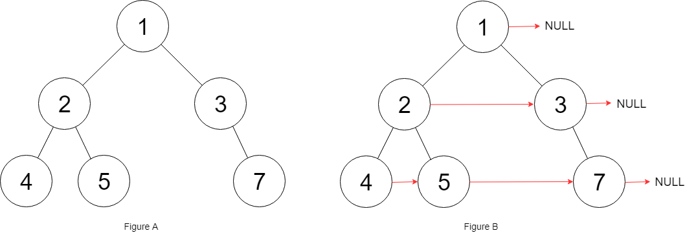
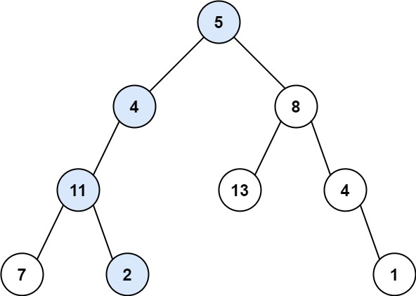
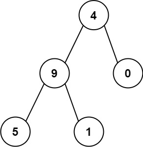

# 二叉树的最大深度
给定一个二叉树 root ，返回其最大深度。

二叉树的 最大深度 是指从根节点到最远叶子节点的最长路径上的节点数。

示例 1：

    输入：root = [3,9,20,null,null,15,7]
    输出：3
示例 2：

    输入：root = [1,null,2]
    输出：2
# 相同的树
给你两棵二叉树的根节点 p 和 q ，编写一个函数来检验这两棵树是否相同。

如果两个树在结构上相同，并且节点具有相同的值，则认为它们是相同的。

示例 1：

    输入：p = [1,2,3], q = [1,2,3]
    输出：true
示例 2：

    输入：p = [1,2], q = [1,null,2]
    输出：false
# 翻转二叉树
给你一棵二叉树的根节点 root ，翻转这棵二叉树，并返回其根节点。

示例 1：

    输入：root = [4,2,7,1,3,6,9]
    输出：[4,7,2,9,6,3,1]
示例 2：

    输入：root = [2,1,3]
    输出：[2,3,1]
# 对称二叉树
给你一个二叉树的根节点 root ， 检查它是否轴对称。

示例 1：

    输入：root = [1,2,2,3,4,4,3]
    输出：true
示例 2：

    输入：root = [1,2,2,null,3,null,3]
    输出：false
# 从前序与中序遍历序列构造二叉树
给定两个整数数组 preorder 和 inorder ，其中 preorder 是二叉树的先序遍历， inorder 是同一棵树的中序遍历，请构造二叉树并返回其根节点。

示例 1:

    输入: preorder = [3,9,20,15,7], inorder = [9,3,15,20,7]
    输出: [3,9,20,null,null,15,7]
示例 2:

    输入: preorder = [-1], inorder = [-1]
    输出: [-1]
# 从中序与后序遍历序列构造二叉树
给定两个整数数组 inorder 和 postorder ，其中 inorder 是二叉树的中序遍历， postorder 是同一棵树的后序遍历，请你构造并返回这颗 二叉树 。

示例 1:

    输入：inorder = [9,3,15,20,7], postorder = [9,15,7,20,3]
    输出：[3,9,20,null,null,15,7]
示例 2:

    输入：inorder = [-1], postorder = [-1]
    输出：[-1]
# 填充每个节点的下一个右侧节点指针 II
给定一个二叉树：

    struct Node {
    int val;
    Node *left;
    Node *right;
    Node *next;
    }
填充它的每个 next 指针，让这个指针指向其下一个右侧节点。如果找不到下一个右侧节点，则将 next 指针设置为 NULL 。

初始状态下，所有 next 指针都被设置为 NULL 。

示例 1：

    输入：root = [1,2,3,4,5,null,7]
    输出：[1,#,2,3,#,4,5,7,#]
    解释：给定二叉树如图 A 所示，你的函数应该填充它的每个 next 指针，以指向其下一个右侧节点，如图 B 所示。序列化输出按层序遍历顺序（由 next 指针连接），'#' 表示每层的末尾。
示例 2：

    输入：root = []
    输出：[]
# 二叉树展开为链表
给你二叉树的根结点 root ，请你将它展开为一个单链表：

- 展开后的单链表应该同样使用 TreeNode ，其中 right 子指针指向链表中下一个结点，而左子指针始终为 null 。
- 展开后的单链表应该与二叉树 先序遍历 顺序相同。

示例 1：

    输入：root = [1,2,5,3,4,null,6]
    输出：[1,null,2,null,3,null,4,null,5,null,6]
示例 2：

    输入：root = []
    输出：[]
示例 3：

    输入：root = [0]
    输出：[0]
# 路径总和
给你二叉树的根节点 root 和一个表示目标和的整数 targetSum 。判断该树中是否存在 根节点到叶子节点 的路径，这条路径上所有节点值相加等于目标和 targetSum 。如果存在，返回 true ；否则，返回 false 。

叶子节点 是指没有子节点的节点。

示例 1：

    输入：root = [5,4,8,11,null,13,4,7,2,null,null,null,1], targetSum = 22
    输出：true
    解释：等于目标和的根节点到叶节点路径如上图所示。
示例 2：

    输入：root = [1,2,3], targetSum = 5
    输出：false
    解释：树中存在两条根节点到叶子节点的路径：
    (1 --> 2): 和为 3
    (1 --> 3): 和为 4
    不存在 sum = 5 的根节点到叶子节点的路径。
示例 3：

    输入：root = [], targetSum = 0
    输出：false
    解释：由于树是空的，所以不存在根节点到叶子节点的路径。
# 求根节点到叶节点数字之和
给你一个二叉树的根节点 root ，树中每个节点都存放有一个 0 到 9 之间的数字。
每条从根节点到叶节点的路径都代表一个数字：

- 例如，从根节点到叶节点的路径 1 -> 2 -> 3 表示数字 123 。

计算从根节点到叶节点生成的 所有数字之和 。

叶节点 是指没有子节点的节点。

示例 1：

    输入：root = [1,2,3]
    输出：25
    解释：
    从根到叶子节点路径 1->2 代表数字 12
    从根到叶子节点路径 1->3 代表数字 13
    因此，数字总和 = 12 + 13 = 25
示例 2：

    输入：root = [4,9,0,5,1]
    输出：1026
    解释：
    从根到叶子节点路径 4->9->5 代表数字 495
    从根到叶子节点路径 4->9->1 代表数字 491
    从根到叶子节点路径 4->0 代表数字 40
    因此，数字总和 = 495 + 491 + 40 = 1026
# 二叉树中的最大路径和
二叉树中的 路径 被定义为一条节点序列，序列中每对相邻节点之间都存在一条边。同一个节点在一条路径序列中 至多出现一次 。该路径 至少包含一个 节点，且不一定经过根节点。

路径和 是路径中各节点值的总和。

给你一个二叉树的根节点 root ，返回其 最大路径和 。

示例 1：

    输入：root = [1,2,3]
    输出：6
    解释：最优路径是 2 -> 1 -> 3 ，路径和为 2 + 1 + 3 = 6
示例 2：

    输入：root = [-10,9,20,null,null,15,7]
    输出：42
    解释：最优路径是 15 -> 20 -> 7 ，路径和为 15 + 20 + 7 = 42
# 二叉搜索树迭代器
实现一个二叉搜索树迭代器类BSTIterator ，表示一个按中序遍历二叉搜索树（BST）的迭代器：
- BSTIterator(TreeNode root) 初始化 BSTIterator 类的一个对象。BST 的根节点 root 会作为构造函数的一部分给出。指针应初始化为一个不存在于 BST 中的数字，且该数字小于 BST 中的任何元素。
- boolean hasNext() 如果向指针右侧遍历存在数字，则返回 true ；否则返回 false 。
- int next()将指针向右移动，然后返回指针处的数字。

注意，指针初始化为一个不存在于 BST 中的数字，所以对 next() 的首次调用将返回 BST 中的最小元素。

你可以假设 next() 调用总是有效的，也就是说，当调用 next() 时，BST 的中序遍历中至少存在一个下一个数字。

示例：

    输入
    ["BSTIterator", "next", "next", "hasNext", "next", "hasNext", "next", "hasNext", "next", "hasNext"]
    [[[7, 3, 15, null, null, 9, 20]], [], [], [], [], [], [], [], [], []]
    输出
    [null, 3, 7, true, 9, true, 15, true, 20, false]

    解释
    BSTIterator bSTIterator = new BSTIterator([7, 3, 15, null, null, 9, 20]);
    bSTIterator.next();    // 返回 3
    bSTIterator.next();    // 返回 7
    bSTIterator.hasNext(); // 返回 True
    bSTIterator.next();    // 返回 9
    bSTIterator.hasNext(); // 返回 True
    bSTIterator.next();    // 返回 15
    bSTIterator.hasNext(); // 返回 True
    bSTIterator.next();    // 返回 20
    bSTIterator.hasNext(); // 返回 False
# 完全二叉树的节点个数
给你一棵 完全二叉树 的根节点 root ，求出该树的节点个数。

完全二叉树 的定义如下：在完全二叉树中，除了最底层节点可能没填满外，其余每层节点数都达到最大值，并且最下面一层的节点都集中在该层最左边的若干位置。若最底层为第 h 层，则该层包含 1~ 2h 个节点。

示例 1：

    输入：root = [1,2,3,4,5,6]
    输出：6
示例 2：

    输入：root = []
    输出：0
示例 3：

    输入：root = [1]
    输出：1
# 二叉树的最近公共祖先
给定一个二叉树, 找到该树中两个指定节点的最近公共祖先。

百度百科中最近公共祖先的定义为：“对于有根树 T 的两个节点 p、q，最近公共祖先表示为一个节点 x，满足 x 是 p、q 的祖先且 x 的深度尽可能大（一个节点也可以是它自己的祖先）。”

示例 1：

    输入：root = [3,5,1,6,2,0,8,null,null,7,4], p = 5, q = 1
    输出：3
    解释：节点 5 和节点 1 的最近公共祖先是节点 3 。
示例 2：

    输入：root = [3,5,1,6,2,0,8,null,null,7,4], p = 5, q = 4
    输出：5
    解释：节点 5 和节点 4 的最近公共祖先是节点 5 。因为根据定义最近公共祖先节点可以为节点本身。
示例 3：

    输入：root = [1,2], p = 1, q = 2
    输出：1 
