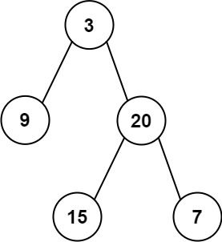

# 二叉树的右视图
给定一个二叉树的 根节点 root，想象自己站在它的右侧，按照从顶部到底部的顺序，返回从右侧所能看到的节点值。

示例 1:

    输入: [1,2,3,null,5,null,4]
    输出: [1,3,4]
示例 2:

    输入: [1,null,3]
    输出: [1,3]
示例 3:

    输入: []
    输出: []
# 二叉树的层平均值
给定一个非空二叉树的根节点 root , 以数组的形式返回每一层节点的平均值。与实际答案相差 10-5 以内的答案可以被接受。

示例 1：

    输入：root = [3,9,20,null,null,15,7]
    输出：[3.00000,14.50000,11.00000]
    解释：第 0 层的平均值为 3,第 1 层的平均值为 14.5,第 2 层的平均值为 11 。
    因此返回 [3, 14.5, 11] 。
示例 2:

    输入：root = [3,9,20,15,7]
    输出：[3.00000,14.50000,11.00000]
# 二叉树的层序遍历
给你二叉树的根节点 root ，返回其节点值的 层序遍历 。 （即逐层地，从左到右访问所有节点）。

示例 1：

    输入：root = [3,9,20,null,null,15,7]
    输出：[[3],[9,20],[15,7]]
示例 2：

    输入：root = [1]
    输出：[[1]]
示例 3：

    输入：root = []
    输出：[]
# 二叉树的锯齿形层序遍历
给你二叉树的根节点 root ，返回其节点值的 锯齿形层序遍历 。（即先从左往右，再从右往左进行下一层遍历，以此类推，层与层之间交替进行）。

示例 1：

    输入：root = [3,9,20,null,null,15,7]
    输出：[[3],[20,9],[15,7]]
示例 2：

    输入：root = [1]
    输出：[[1]]
示例 3：    

    输入：root = []
    输出：[]