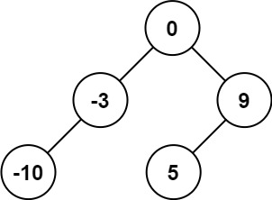
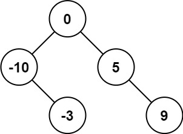
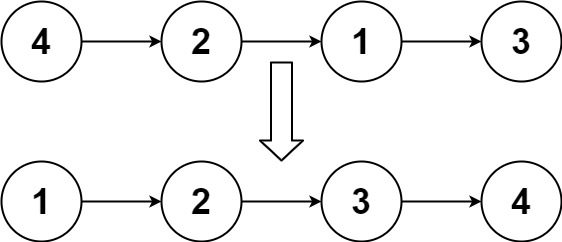
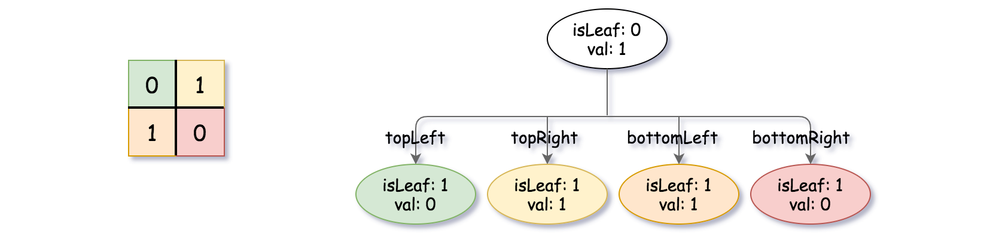

# 将有序数组转换为二叉搜索树
给你一个整数数组 nums ，其中元素已经按 升序 排列，请你将其转换为一棵平衡二叉搜索树。

示例 1：



  - 输入：nums = [-10,-3,0,5,9]
  - 输出：[0,-3,9,-10,null,5]
  - 解释：[0,-10,5,null,-3,null,9] 也将被视为正确答案：



示例 2：


  - 输入：nums = [1,3]
  - 输出：[3,1]
  - 解释：[1,null,3] 和 [3,1] 都是高度平衡二叉搜索树。
# 排序链表
给你链表的头结点 head ，请将其按 升序 排列并返回 排序后的链表 。

示例 1：



  - 输入：head = [4,2,1,3]
  - 输出：[1,2,3,4]
# 建立四叉树
给你一个 n * n 矩阵 grid ，矩阵由若干 0 和 1 组成。请你用四叉树表示该矩阵 grid 。

你需要返回能表示矩阵 grid 的 四叉树 的根结点。

四叉树数据结构中，每个内部节点只有四个子节点。此外，每个节点都有两个属性：

- val：储存叶子结点所代表的区域的值。1 对应 True，0 对应 False。注意，当 isLeaf 为 False 时，你可以把 True 或者 False 赋值给节点，两种值都会被判题机制 接受 。
- isLeaf: 当这个节点是一个叶子结点时为 True，如果它有 4 个子节点则为 False 。
```
class Node {
    public boolean val;
    public boolean isLeaf;
    public Node topLeft;
    public Node topRight;
    public Node bottomLeft;
    public Node bottomRight;
}
```
我们可以按以下步骤为二维区域构建四叉树：

1. 如果当前网格的值相同（即，全为 0 或者全为 1），将 isLeaf 设为 True ，将 val 设为网格相应的值，并将四个子节点都设为 Null 然后停止。
2. 如果当前网格的值不同，将 isLeaf 设为 False， 将 val 设为任意值，然后如下图所示，将当前网格划分为四个子网格。
3. 使用适当的子网格递归每个子节点。


如果你想了解更多关于四叉树的内容，可以参考 [wiki](https://en.wikipedia.org/wiki/Quadtree) 。

**四叉树格式**：

你不需要阅读本节来解决这个问题。只有当你想了解输出格式时才会这样做。输出为使用层序遍历后四叉树的序列化形式，其中 null 表示路径终止符，其下面不存在节点。

它与二叉树的序列化非常相似。唯一的区别是节点以列表形式表示 [isLeaf, val] 。

如果 isLeaf 或者 val 的值为 True ，则表示它在列表 [isLeaf, val] 中的值为 1 ；如果 isLeaf 或者 val 的值为 False ，则表示值为 0 。

示例 1：


  - 输入：grid = [[0,1],[1,0]]
  - 输出：[[0,1],[1,0],[1,1],[1,1],[1,0]]
  - 解释：此示例的解释如下：
  
  请注意，在下面四叉树的图示中，0 表示 false，1 表示 True 。



# 合并 K 个升序链表
给你一个链表数组，每个链表都已经按升序排列。

请你将所有链表合并到一个升序链表中，返回合并后的链表。

示例 1：

  - 输入：lists = [[1,4,5],[1,3,4],[2,6]]
  - 输出：[1,1,2,3,4,4,5,6]
  - 解释：链表数组如下：

  ```
  [
    1->4->5,
    1->3->4,
    2->6
  ]
  将它们合并到一个有序链表中得到。
  1->1->2->3->4->4->5->6
  ```
示例 2：

输入：lists = []
输出：[]

示例 3：

输入：lists = [[]]
输出：[]