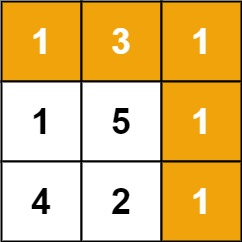
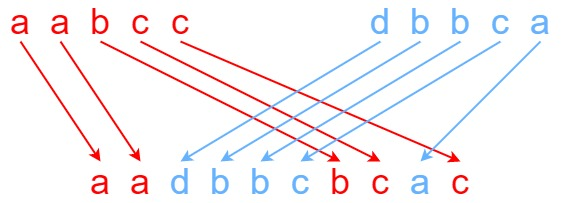
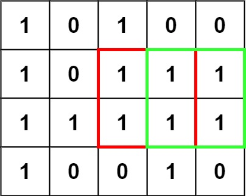
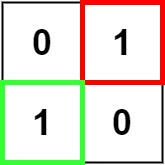

# 三角形最小路径和
给定一个三角形 triangle ，找出自顶向下的最小路径和。

每一步只能移动到下一行中相邻的结点上。相邻的结点 在这里指的是 下标 与 上一层结点下标 相同或者等于 上一层结点下标 + 1 的两个结点。也就是说，如果正位于当前行的下标 i ，那么下一步可以移动到下一行的下标 i 或 i + 1 。

示例 1：

    输入：triangle = [[2],[3,4],[6,5,7],[4,1,8,3]]
    输出：11
    解释：如下面简图所示：
    2
    3 4
    6 5 7
    4 1 8 3
    自顶向下的最小路径和为 11（即，2 + 3 + 5 + 1 = 11）。
示例 2：

    输入：triangle = [[-10]]
    输出：-10
# 最小路径和
给定一个包含非负整数的 m x n 网格 grid ，请找出一条从左上角到右下角的路径，使得路径上的数字总和为最小。

说明：每次只能向下或者向右移动一步。

示例 1：

    输入：grid = [[1,3,1],[1,5,1],[4,2,1]]
    输出：7
    解释：因为路径 1→3→1→1→1 的总和最小。
示例 2：

    输入：grid = [[1,2,3],[4,5,6]]
    输出：12
# 不同路径 II
一个机器人位于一个 m x n 网格的左上角 （起始点在下图中标记为 “Start” ）。

机器人每次只能向下或者向右移动一步。机器人试图达到网格的右下角（在下图中标记为 “Finish”）。

现在考虑网格中有障碍物。那么从左上角到右下角将会有多少条不同的路径？

网格中的障碍物和空位置分别用 1 和 0 来表示。

示例 1：

    输入：obstacleGrid = [[0,0,0],[0,1,0],[0,0,0]]
    输出：2
    解释：3x3 网格的正中间有一个障碍物。
    从左上角到右下角一共有 2 条不同的路径：
    1. 向右 -> 向右 -> 向下 -> 向下
    2. 向下 -> 向下 -> 向右 -> 向右
# 最长回文子串
给你一个字符串 s，找到 s 中最长的回文子串。

如果字符串的反序与原始字符串相同，则该字符串称为回文字符串。

示例 1：

    输入：s = "babad"
    输出："bab"
    解释："aba" 同样是符合题意的答案。
示例 2：

    输入：s = "cbbd"
    输出："bb"
# 交错字符串
给定三个字符串 s1、s2、s3，请你帮忙验证 s3 是否是由 s1 和 s2 交错 组成的。

两个字符串 s 和 t 交错 的定义与过程如下，其中每个字符串都会被分割成若干 非空 
子字符串：

- s = s1 + s2 + ... + sn
- t = t1 + t2 + ... + tm
- |n - m| <= 1
- 交错 是 s1 + t1 + s2 + t2 + s3 + t3 + ... 或者 t1 + s1 + t2 + s2 + t3 + s3 + ...

注意：a + b 意味着字符串 a 和 b 连接。

示例 1：

    输入：s1 = "aabcc", s2 = "dbbca", s3 = "aadbbcbcac"
    输出：true
示例 2：

    输入：s1 = "aabcc", s2 = "dbbca", s3 = "aadbbbaccc"
    输出：false
示例 3：

    输入：s1 = "", s2 = "", s3 = ""
    输出：true
# 编辑距离
给你两个单词 word1 和 word2， 请返回将 word1 转换成 word2 所使用的最少操作数  。

你可以对一个单词进行如下三种操作：

- 插入一个字符
- 删除一个字符
- 替换一个字符

示例 1：

    输入：word1 = "horse", word2 = "ros"
    输出：3
    解释：
    horse -> rorse (将 'h' 替换为 'r')
    rorse -> rose (删除 'r')
    rose -> ros (删除 'e')
示例 2：

    输入：word1 = "intention", word2 = "execution"
    输出：5
    解释：
    intention -> inention (删除 't')
    inention -> enention (将 'i' 替换为 'e')
    enention -> exention (将 'n' 替换为 'x')
    exention -> exection (将 'n' 替换为 'c')
    exection -> execution (插入 'u')
# 买卖股票的最佳时机 III
给定一个数组，它的第 i 个元素是一支给定的股票在第 i 天的价格。

设计一个算法来计算你所能获取的最大利润。你最多可以完成 两笔 交易。

注意：你不能同时参与多笔交易（你必须在再次购买前出售掉之前的股票）。

示例 1:

    输入：prices = [3,3,5,0,0,3,1,4]
    输出：6
    解释：在第 4 天（股票价格 = 0）的时候买入，在第 6 天（股票价格 = 3）的时候卖出，这笔交易所能获得利润 = 3-0 = 3 。
        随后，在第 7 天（股票价格 = 1）的时候买入，在第 8 天 （股票价格 = 4）的时候卖出，这笔交易所能获得利润 = 4-1 = 3 。
示例 2：

    输入：prices = [1,2,3,4,5]
    输出：4
    解释：在第 1 天（股票价格 = 1）的时候买入，在第 5 天 （股票价格 = 5）的时候卖出, 这笔交易所能获得利润 = 5-1 = 4 。   
        注意你不能在第 1 天和第 2 天接连购买股票，之后再将它们卖出。   
        因为这样属于同时参与了多笔交易，你必须在再次购买前出售掉之前的股票。
# 买卖股票的最佳时机 IV
给你一个整数数组 prices 和一个整数 k ，其中 prices[i] 是某支给定的股票在第 i 天的价格。

设计一个算法来计算你所能获取的最大利润。你最多可以完成 k 笔交易。也就是说，你最多可以买 k 次，卖 k 次。

注意：你不能同时参与多笔交易（你必须在再次购买前出售掉之前的股票）。 

示例 1：

    输入：k = 2, prices = [2,4,1]
    输出：2
    解释：在第 1 天 (股票价格 = 2) 的时候买入，在第 2 天 (股票价格 = 4) 的时候卖出，这笔交易所能获得利润 = 4-2 = 2 。
示例 2：

    输入：k = 2, prices = [3,2,6,5,0,3]
    输出：7
    解释：在第 2 天 (股票价格 = 2) 的时候买入，在第 3 天 (股票价格 = 6) 的时候卖出, 这笔交易所能获得利润 = 6-2 = 4 。
        随后，在第 5 天 (股票价格 = 0) 的时候买入，在第 6 天 (股票价格 = 3) 的时候卖出, 这笔交易所能获得利润 = 3-0 = 3 。
# 最大正方形
在一个由 '0' 和 '1' 组成的二维矩阵内，找到只包含 '1' 的最大正方形，并返回其面积。

示例 1：

    输入：matrix = [["1","0","1","0","0"],["1","0","1","1","1"],["1","1","1","1","1"],["1","0","0","1","0"]]
    输出：4
示例 2：

    输入：matrix = [["0","1"],["1","0"]]
    输出：1
示例 3：

    输入：matrix = [["0"]]
    输出：0
