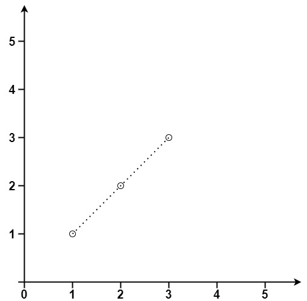
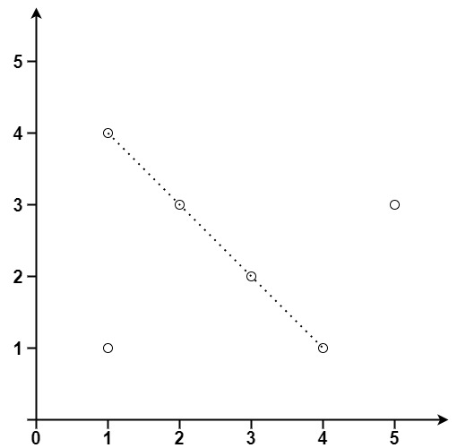

# 回文数
给你一个整数 x ，如果 x 是一个回文整数，返回 true ；否则，返回 false 。

回文数 是指正序（从左向右）和倒序（从右向左）读都是一样的整数。

例如，121 是回文，而 123 不是。

示例 1：

    输入：x = 121
    输出：true
示例 2：

    输入：x = -121
    输出：false
    解释：从左向右读, 为 -121 。 从右向左读, 为 121- 。因此它不是一个回文数。
示例 3：

    输入：x = 10
    输出：false
    解释：从右向左读, 为 01 。因此它不是一个回文数。
# 加一
给定一个由 整数 组成的 非空 数组所表示的非负整数，在该数的基础上加一。

最高位数字存放在数组的首位， 数组中每个元素只存储单个数字。

你可以假设除了整数 0 之外，这个整数不会以零开头。

示例 1：

    输入：digits = [1,2,3]
    输出：[1,2,4]
    解释：输入数组表示数字 123。
示例 2：

    输入：digits = [4,3,2,1]
    输出：[4,3,2,2]
    解释：输入数组表示数字 4321。
示例 3：

    输入：digits = [0]
    输出：[1]

**解题思路：**
根据题意加一，没错就是加一这很重要，因为它是只加一的所以有可能的情况就只有两种：

1. 除 9 之外的数字加一；
2. 数字 9。

加一得十进一位个位数为 000 加法运算如不出现进位就运算结束了且进位只会是一。

所以只需要判断有没有进位并模拟出它的进位方式，如十位数加 111 个位数置为 000，如此循环直到判断没有再进位就退出循环返回结果。

然后还有一些特殊情况就是当出现 999999、999999999 之类的数字时，循环到最后也需要进位，出现这种情况时需要手动将它进一位。

作者：YHHZW
链接：https://leetcode.cn/problems/plus-one/solutions/4481/java-shu-xue-jie-ti-by-yhhzw/
来源：力扣（LeetCode）
著作权归作者所有。商业转载请联系作者获得授权，非商业转载请注明出处。
# 阶乘后的零
给定一个整数 n ，返回 n! 结果中尾随零的数量。

提示 n! = n * (n - 1) * (n - 2) * ... * 3 * 2 * 1

示例 1：

    输入：n = 3
    输出：0
    解释：3! = 6 ，不含尾随 0
示例 2：

    输入：n = 5
    输出：1
    解释：5! = 120 ，有一个尾随 0
示例 3：

    输入：n = 0
    输出：0
# x 的平方根 
给你一个非负整数 x ，计算并返回 x 的 算术平方根 。

由于返回类型是整数，结果只保留 整数部分 ，小数部分将被 舍去 。

注意：不允许使用任何内置指数函数和算符，例如 pow(x, 0.5) 或者 x ** 0.5 。

示例 1：

    输入：x = 4
    输出：2
示例 2：

    输入：x = 8
    输出：2
    解释：8 的算术平方根是 2.82842..., 由于返回类型是整数，小数部分将被舍去。
# Pow(x, n)
实现 pow(x, n) ，即计算 x 的整数 n 次幂函数（即，xn ）。

示例 1：

    输入：x = 2.00000, n = 10
    输出：1024.00000
示例 2：

    输入：x = 2.10000, n = 3
    输出：9.26100
示例 3：

    输入：x = 2.00000, n = -2
   
    输出：0.25000
    解释：2-2 = 1/22 = 1/4 = 0.25
# 直线上最多的点数
给你一个数组 points ，其中 points[i] = [xi, yi] 表示 X-Y 平面上的一个点。求最多有多少个点在同一条直线上。

示例 1：

    输入：points = [[1,1],[2,2],[3,3]]
    输出：3
示例 2：

    输入：points = [[1,1],[3,2],[5,3],[4,1],[2,3],[1,4]]
    输出：4