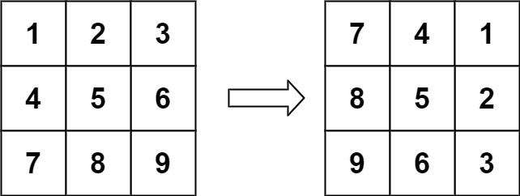
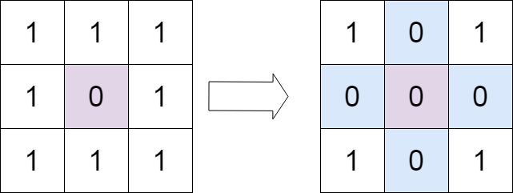

# 有效的数独
请你判断一个 9 x 9 的数独是否有效。只需要 根据以下规则 ，验证已经填入的数字是否有效即可。

1. 数字 1-9 在每一行只能出现一次。
2. 数字 1-9 在每一列只能出现一次。
3. 数字 1-9 在每一个以粗实线分隔的 3x3 宫内只能出现一次。（请参考示例图）

注意：

- 一个有效的数独（部分已被填充）不一定是可解的。
- 只需要根据以上规则，验证已经填入的数字是否有效即可。
- 空白格用 '.' 表示。

示例 1：

    输入：board = 
    [["5","3",".",".","7",".",".",".","."]
    ,["6",".",".","1","9","5",".",".","."]
    ,[".","9","8",".",".",".",".","6","."]
    ,["8",".",".",".","6",".",".",".","3"]
    ,["4",".",".","8",".","3",".",".","1"]
    ,["7",".",".",".","2",".",".",".","6"]
    ,[".","6",".",".",".",".","2","8","."]
    ,[".",".",".","4","1","9",".",".","5"]
    ,[".",".",".",".","8",".",".","7","9"]]
    输出：true
示例 2：

    输入：board = 
    [["8","3",".",".","7",".",".",".","."]
    ,["6",".",".","1","9","5",".",".","."]
    ,[".","9","8",".",".",".",".","6","."]
    ,["8",".",".",".","6",".",".",".","3"]
    ,["4",".",".","8",".","3",".",".","1"]
    ,["7",".",".",".","2",".",".",".","6"]
    ,[".","6",".",".",".",".","2","8","."]
    ,[".",".",".","4","1","9",".",".","5"]
    ,[".",".",".",".","8",".",".","7","9"]]
    输出：false
    解释：除了第一行的第一个数字从 5 改为 8 以外，空格内其他数字均与 示例1 相同。 但由于位于左上角的 3x3 宫内有两个 8 存在, 因此这个数独是无效的。
# 螺旋矩阵
给你一个 m 行 n 列的矩阵 matrix ，请按照 顺时针螺旋顺序 ，返回矩阵中的所有元素。

示例 1：

    输入：matrix = [[1,2,3],[4,5,6],[7,8,9]]
    输出：[1,2,3,6,9,8,7,4,5]
示例 2：

    输入：matrix = [[1,2,3,4],[5,6,7,8],[9,10,11,12]]
    输出：[1,2,3,4,8,12,11,10,9,5,6,7]

# 旋转图像
给定一个 n × n 的二维矩阵 matrix 表示一个图像。请你将图像顺时针旋转 90 度。

你必须在 原地 旋转图像，这意味着你需要直接修改输入的二维矩阵。请不要 使用另一个矩阵来旋转图像。

示例 1：

    输入：matrix = [[1,2,3],[4,5,6],[7,8,9]]
    输出：[[7,4,1],[8,5,2],[9,6,3]]
示例 2：

    输入：matrix = [[5,1,9,11],[2,4,8,10],[13,3,6,7],[15,14,12,16]]
    输出：[[15,13,2,5],[14,3,4,1],[12,6,8,9],[16,7,10,11]]
# 矩阵置零
给定一个 m x n 的矩阵，如果一个元素为 0 ，则将其所在行和列的所有元素都设为 0 。请使用 原地 算法。

示例 1：

    输入：matrix = [[1,1,1],[1,0,1],[1,1,1]]
    输出：[[1,0,1],[0,0,0],[1,0,1]]
示例 2：

    输入：matrix = [[0,1,2,0],[3,4,5,2],[1,3,1,5]]
    输出：[[0,0,0,0],[0,4,5,0],[0,3,1,0]]

# 生命游戏
根据 百度百科 ， 生命游戏 ，简称为 生命 ，是英国数学家约翰·何顿·康威在 1970 年发明的细胞自动机。

给定一个包含 m × n 个格子的面板，每一个格子都可以看成是一个细胞。每个细胞都具有一个初始状态： 1 即为 活细胞 （live），或 0 即为 死细胞 （dead）。每个细胞与其八个相邻位置（水平，垂直，对角线）的细胞都遵循以下四条生存定律：

1. 如果活细胞周围八个位置的活细胞数少于两个，则该位置活细胞死亡；
2. 如果活细胞周围八个位置有两个或三个活细胞，则该位置活细胞仍然存活；
3. 如果活细胞周围八个位置有超过三个活细胞，则该位置活细胞死亡；
4. 如果死细胞周围正好有三个活细胞，则该位置死细胞复活；

下一个状态是通过将上述规则同时应用于当前状态下的每个细胞所形成的，其中细胞的出生和死亡是同时发生的。给你 m x n 网格面板 board 的当前状态，返回下一个状态。

示例 1：

    输入：board = [[0,1,0],[0,0,1],[1,1,1],[0,0,0]]
    输出：[[0,0,0],[1,0,1],[0,1,1],[0,1,0]]
示例 2：

    输入：board = [[1,1],[1,0]]
    输出：[[1,1],[1,1]]