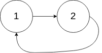
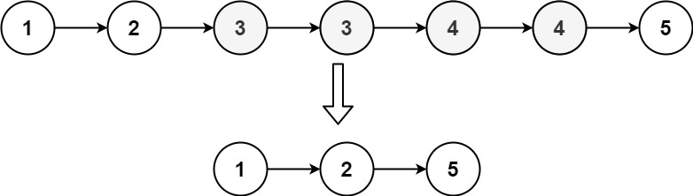

# 环形链表
给你一个链表的头节点 head ，判断链表中是否有环。

如果链表中有某个节点，可以通过连续跟踪 next 指针再次到达，则链表中存在环。 为了表示给定链表中的环，评测系统内部使用整数 pos 来表示链表尾连接到链表中的位置（索引从 0 开始）。注意：pos 不作为参数进行传递 。仅仅是为了标识链表的实际情况。

如果链表中存在环 ，则返回 true 。 否则，返回 false 。

示例 1：

    输入：head = [3,2,0,-4], pos = 1
    输出：true
    解释：链表中有一个环，其尾部连接到第二个节点。

示例 2：

    输入：head = [1,2], pos = 0
    输出：true
    解释：链表中有一个环，其尾部连接到第一个节点。

示例 3：

    输入：head = [1], pos = -1
    输出：false
    解释：链表中没有环。
# 两数相加
给你两个 非空 的链表，表示两个非负的整数。它们每位数字都是按照 逆序 的方式存储的，并且每个节点只能存储 一位 数字。

请你将两个数相加，并以相同形式返回一个表示和的链表。

你可以假设除了数字 0 之外，这两个数都不会以 0 开头。

示例 1：

    输入：l1 = [2,4,3], l2 = [5,6,4]
    输出：[7,0,8]
    解释：342 + 465 = 807.
# 合并两个有序链表
将两个升序链表合并为一个新的 升序 链表并返回。新链表是通过拼接给定的两个链表的所有节点组成的。 

示例 1：

    输入：l1 = [1,2,4], l2 = [1,3,4]
    输出：[1,1,2,3,4,4]
# 随机链表的复制
给你一个长度为 n 的链表，每个节点包含一个额外增加的随机指针 random ，该指针可以指向链表中的任何节点或空节点。

构造这个链表的 深拷贝。 深拷贝应该正好由 n 个 全新 节点组成，其中每个新节点的值都设为其对应的原节点的值。新节点的 next 指针和 random 指针也都应指向复制链表中的新节点，并使原链表和复制链表中的这些指针能够表示相同的链表状态。**复制链表中的指针都不应指向原链表中的节点** 。

例如，如果原链表中有 X 和 Y 两个节点，其中 X.random --> Y 。那么在复制链表中对应的两个节点 x 和 y ，同样有 x.random --> y 。

返回复制链表的头节点。

用一个由 n 个节点组成的链表来表示输入/输出中的链表。每个节点用一个 [val, random_index] 表示：

- val：一个表示 Node.val 的整数。
- random_index：随机指针指向的节点索引（范围从 0 到 n-1）；如果不指向任何节点，则为  null 。

你的代码 只 接受原链表的头节点 head 作为传入参数。

示例 1：

    输入：head = [[7,null],[13,0],[11,4],[10,2],[1,0]]
    输出：[[7,null],[13,0],[11,4],[10,2],[1,0]]
示例 2：

    输入：head = [[1,1],[2,1]]
    输出：[[1,1],[2,1]]
# 反转链表 II
给你单链表的头指针 head 和两个整数 left 和 right ，其中 left <= right 。请你反转从位置 left 到位置 right 的链表节点，返回 反转后的链表 。

示例 1：

    输入：head = [1,2,3,4,5], left = 2, right = 4
    输出：[1,4,3,2,5]
示例 2：

    输入：head = [5], left = 1, right = 1
    输出：[5]
# K 个一组翻转链表
给你链表的头节点 head ，每 k 个节点一组进行翻转，请你返回修改后的链表。

k 是一个正整数，它的值小于或等于链表的长度。如果节点总数不是 k 的整数倍，那么请将最后剩余的节点保持原有顺序。

你不能只是单纯的改变节点内部的值，而是需要实际进行节点交换。

示例 1：

    输入：head = [1,2,3,4,5], k = 2
    输出：[2,1,4,3,5]
示例 2：

    输入：head = [1,2,3,4,5], k = 3
    输出：[3,2,1,4,5]
# 删除链表的倒数第 N 个结点
给你一个链表，删除链表的倒数第 n 个结点，并且返回链表的头结点。

示例 1：

    输入：head = [1,2,3,4,5], n = 2
    输出：[1,2,3,5]
示例 2：

    输入：head = [1], n = 1
    输出：[]
示例 3：

    输入：head = [1,2], n = 1
    输出：[1]
# 删除排序链表中的重复元素 II
给定一个已排序的链表的头 head ， 删除原始链表中所有重复数字的节点，只留下不同的数字 。返回 已排序的链表 。

示例 1：

    输入：head = [1,2,3,3,4,4,5]
    输出：[1,2,5]
示例 2：

    输入：head = [1,1,1,2,3]
    输出：[2,3]
# 旋转链表
给你一个链表的头节点 head ，旋转链表，将链表每个节点向右移动 k 个位置。

示例 1：

    输入：head = [1,2,3,4,5], k = 2
    输出：[4,5,1,2,3]
# 分隔链表
给你一个链表的头节点 head 和一个特定值 x ，请你对链表进行分隔，使得所有 小于 x 的节点都出现在 大于或等于 x 的节点之前。

你应当 保留 两个分区中每个节点的初始相对位置。

示例 1：

    输入：head = [1,4,3,2,5,2], x = 3
    输出：[1,2,2,4,3,5]
示例 2：

    输入：head = [2,1], x = 2
    输出：[1,2]
# LRU 缓存
请你设计并实现一个满足  LRU (最近最少使用) 缓存 约束的数据结构。实现 LRUCache 类：
- LRUCache(int capacity) 以 正整数 作为容量 capacity 初始化 LRU 缓存 
- int get(int key) 如果关键字 key 存在于缓存中，则返回关键字的值，否则返回 -1 。
- void put(int key, int value) 如果关键字 key 已经存在，则变更其数据值 value ；如果不存在，则向缓存中插入该组 key-value 。如果插入操作导致关键字数量超过 capacity ，则应该 逐出 最久未使用的关键字。

函数 get 和 put 必须以 O(1) 的平均时间复杂度运行。

示例：

    输入
    ["LRUCache", "put", "put", "get", "put", "get", "put", "get", "get", "get"]
    [[2], [1, 1], [2, 2], [1], [3, 3], [2], [4, 4], [1], [3], [4]]
    输出
    [null, null, null, 1, null, -1, null, -1, 3, 4]

    解释
    LRUCache lRUCache = new LRUCache(2);
    lRUCache.put(1, 1); // 缓存是 {1=1}
    lRUCache.put(2, 2); // 缓存是 {1=1, 2=2}
    lRUCache.get(1);    // 返回 1
    lRUCache.put(3, 3); // 该操作会使得关键字 2 作废，缓存是 {1=1, 3=3}
    lRUCache.get(2);    // 返回 -1 (未找到)
    lRUCache.put(4, 4); // 该操作会使得关键字 1 作废，缓存是 {4=4, 3=3}
    lRUCache.get(1);    // 返回 -1 (未找到)
    lRUCache.get(3);    // 返回 3
    lRUCache.get(4);    // 返回 4
